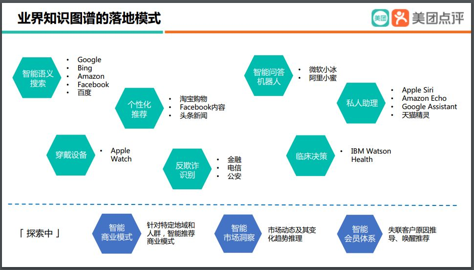
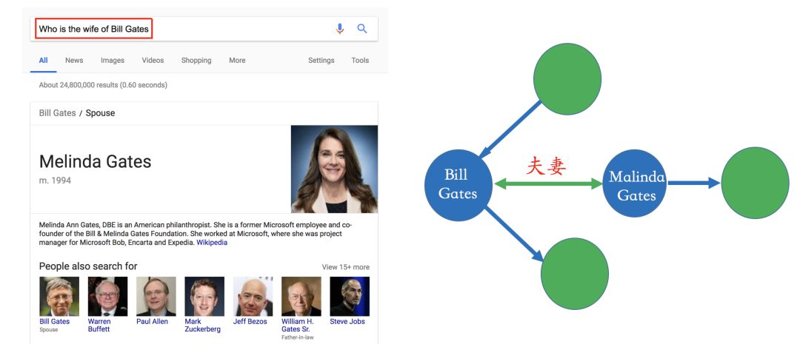
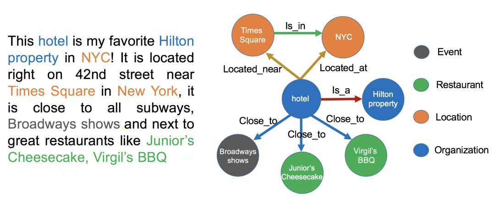
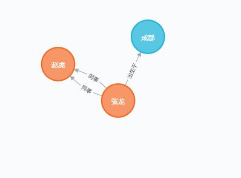
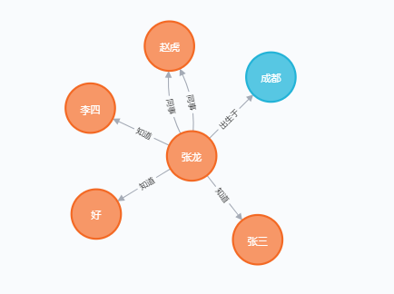
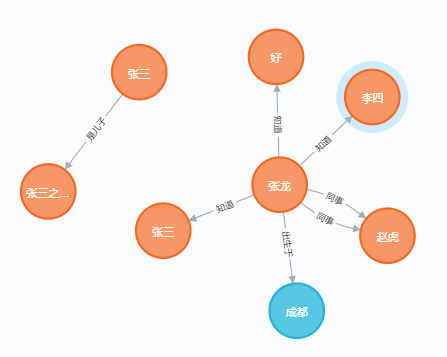

## 一、什么是知识图谱？

知识图谱是由 Google 公司在 2012 年提出来的一个新的概念。 

知识图谱是一种用图模型来描述知识和建模世界万物之间的关联关系的技术方法。知识图谱由节点和边组成。节点可以是实体，如一个人、一本书等，或是抽象的概念，如人工智能、知识图谱等。边可以是实体的属性，如姓名、书名，或是实体之间的关系，如朋友、配偶。知识图谱的早期理念来自Semantic Web（语义网），其最初理想是把基于文本链接的万维网转化成基于实体链接的语义网。

## 二、知识图谱在哪些地方的应用？



当今许许多多的应用都会用上知识图谱，百度google的搜索引擎，华为小米的语音助手，电商医疗金融都有着显著的影响。

## 三、信息抽取和数据处理

互联网很多数据都是结构化的数据，处理结构化数据找不到数据的关系。

在下面的例子中就可以使用三元组表示这个数据。**(BillGates, Married, MalindaGates)**

知识图谱的难点在于处理非结构数据。



#### 3.1 实体命名识别（Named Entity Recognition）

- 实体命名识别（英语：Named Entity Recognition），简称NER
  - 目标：就是从文本里提取出实体并对每个实体做分类/打标签；
  - 举例说明：比如从上述文本里，我们可以提取出实体-“NYC”，并标记实体类型为 “Location”；我们也可以从中提取出“Virgil's BBQ”，并标记实体类型为“Restarant”。
  - 这种过程称之为实体命名识别，这是一项相对比较成熟的技术，有一些现成的工具可以用来做这件事情。

#### 3.2 关系抽取（Relation Extraction）

- 关系抽取（英语：Relation Extraction），简称 RE
  - 介绍：通过关系抽取技术，把实体间的关系从文本中提取出来；
  - 举例说明：比如实体“hotel”和“Hilton property”之间的关系为“in”；“hotel”和“Time Square”的关系为“near”等等。

#### 3.3 实体统一（Entity Resolution）

- 实体统一（英语：Entity Resolution），简称 ER
  - 介绍：对于有些实体写法上不一样，但其实是指向同一个实体；
  - 举例说明：比如“NYC”和“New York”表面上是不同的字符串，但其实指的都是纽约这个城市，需要合并。
  - 价值：实体统一不仅可以减少实体的种类，也可以降低图谱的稀疏性（Sparsity）；

#### 3.4 指代消解（Disambiguation）

- 指代消解（英语：Disambiguation）
  - 介绍：文本中出现的“it”, “he”, “she”这些词到底指向哪个实体，比如在本文里两个被标记出来的“it”都指向“hotel”这个实体。

## 四、数据库选择和数据库下载

本次使用的开源的neo4j.

下载在官网下载。

启动 

```
neo4j.bat console
```

打开浏览器，输入[http://127.0.0.1:7474/browser/](http://127.0.0.1:7474/browser/)

## 五、Neo4j实战

本次实战主要构建下面三种关系：

- Person-Friends-PERSON

- Person-Married-PERSON

- Person-Born_in-Location

5.1 创建人物节点

```
CREATE (n:Person {name:'张龙'}) RETURN n
CREATE (n:Person {name:'赵虎'}) RETURN n
```

5.2 创建地点节点

```
CREATE (n:Location{city:'成都',state:'四川'}) RETURN n
```

5.3 创建人物关系

```
MATCH(a:Person{name:'张龙'}),(b:Person{name:'赵虎'})
MERGE (a)-[:同事]->(b)
```

5.4 增加其他的属性

```
MATCH(a:Person{name:'张龙'}),(b:Person{name:'赵虎'})
MERGE (a)-[:同事 {since:2020}]->(b)
```

5.5创建 出生地关系

```
MATCH (a:Person{name:'张龙'}),(b:Location{city:'成都'}) MERGE (a) - [:出生于{year:2000}] ->(b)
```



 5.6  查询

```
查询生于成都的人
MATCH (a:Person)-[:出生于]->(b:Location {city:"成都"}) RETURN a,b
查询所有对外有关系的节点
MATCH (a)--() RETURN a
查询所有对外有关系的节点，以及关系类型
MATCH (a)-[r]->() RETURN a.name, type(r)
查询所有有结婚关系的节点
MATCH (n)-[:MARRIED]-() RETURN n
```

5.7 删除和修改

```
1.增加/修改节点的属性(SET表示修改操作)
 MATCH (a:Person {name:'张龙'}) SET a.age=34
2.删除节点(删除属性操作主要通过REMOVE)
MATCH (a:Person {name:'张龙'}) SET a.test='test'
MATCH (a:Person {name:'张龙'}) REMOVE a.test
3. 删除节点(删除节点操作是DELETE)
 MATCH (a:Location {city:'成都'}) DELETE a
 4. 删除有关系的节点
MATCH (a:Person {name:'Todd'})-[rel]-(b:Person) DELETE a,b,rel
```

## 五、python操作Neo4j

```python
# 使用neo4j 操作Neo4j
from neo4j import GraphDatabase

driver = GraphDatabase.driver("bolt://localhost:7687", auth=("neo4j", "password"))
def add_friend(tx, name, friend_name):
    tx.run("MERGE (a:Person {name: $name}) "
           "MERGE (a)-[:知道]->(friend:Person {name: $friend_name})",
           name=name, friend_name=friend_name)

def print_friends(tx, name):
    for record in tx.run("MATCH (a:Person)-[:知道]->(friend) WHERE a.name = $name "
                         "RETURN friend.name ORDER BY friend.name", name=name):
        print(record["friend.name"])

with driver.session() as session:
    session.write_transaction(add_friend, "张龙", "张三")
    session.write_transaction(add_friend, "张龙", "李四")
    session.write_transaction(add_friend, "张龙", "好")
    session.read_transaction(print_friends, "张龙")

driver.close()
```



```
# 使用py2neo 操作Neo4j
from py2neo import Graph, Node, Relationship

g = Graph("http://localhost:7474",auth=("neo4j","password"))
# step 3：创建节点
tx = g.begin()
a = Node("Person", name="张三")
tx.create(a)
b = Node("Person", name="张三之父亲")
# step 4：创建边
ab = Relationship(a, "是儿子", b)
# step 5：运行
tx.create(ab)
tx.commit()

```

