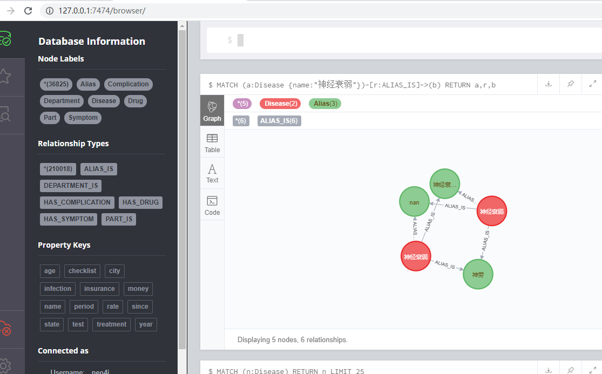

## 一、运行环境及下载代码

准备运行环境

- python3.0及以上
- neo4j 3.5.0及以上
- jdk 1.8.0

```
下载 基于医疗领域知识图谱的问答系统的代码
git clone https://github.com/zhihao-chen/QASystemOnMedicalGraph.git
```

## 二、知识图谱数据导入

安装好neo4j然后安装脚本需要的库

```
pip install py2neo
pip install pandas
```

然后运行如下命令

```
python build_graph.py 
```

改数据比较多，运行了一个多小时

在同时运行本脚本的时候请百度云下载 这个也有1G左右的数据

```
Python3 数据库：neo4j 预训练词向量：https://github.com/Embedding/Chinese-Word-Vectors或https://pan.baidu.com/s/14JP1gD7hcmsWdSpTvA3vKA
```

经过漫长的等待终于数据加载完了



## 三、运行医疗管理系统

```
python kbqa_test.py
```

运行本代码也出现了许多问题

```
pip install pyahocorasick
pip install scikit-learn==0.20.4
安装失败的可以是conda进行安装
```


这个运行的太慢了，代码每次都要加载word2vec模型，修改之后就好多了