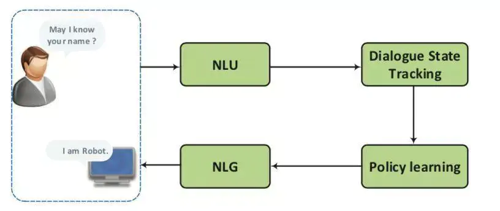
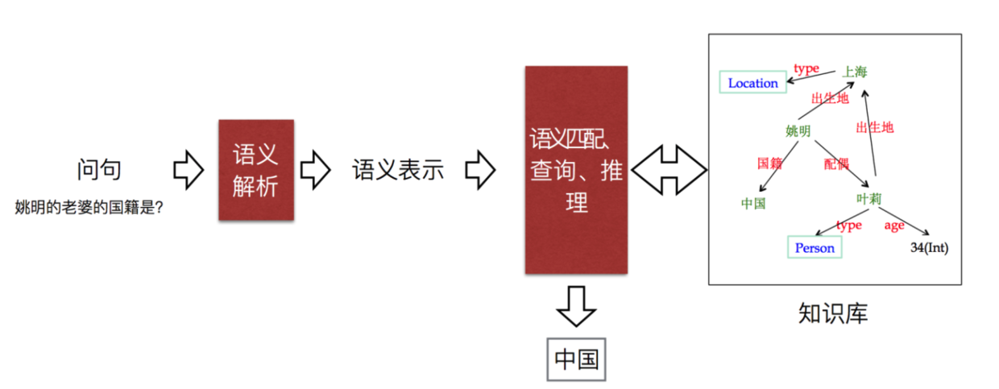
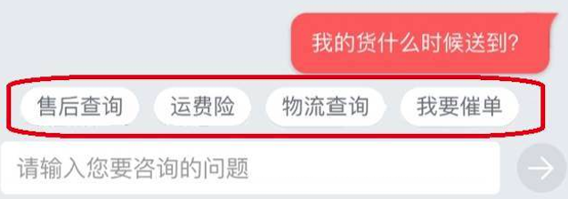
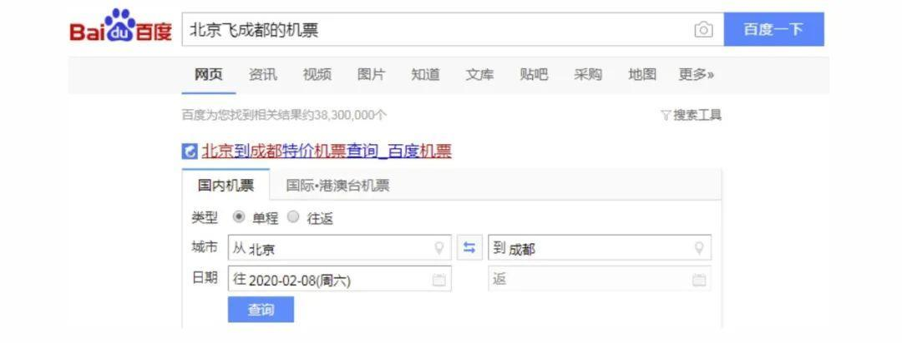
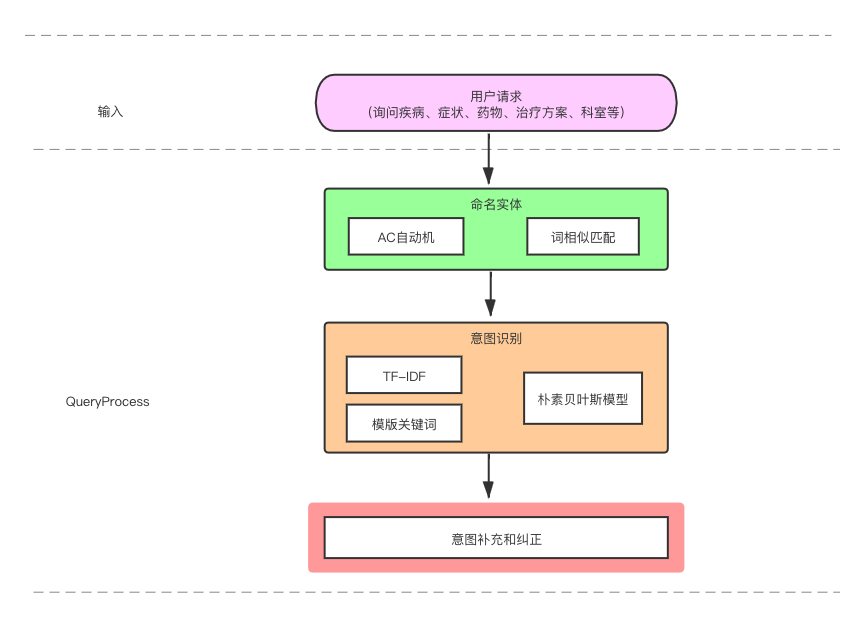

## 一、问答习题简介

问答系统(Question Answering System，QA System)是用来回答人提出的自然语言问题的系统。根据划分标准不同，问答系统可以被分为各种不同的类型。

* 问答系统从知识领域划分：
  * 封闭领域：封闭领域系统专注于回答特定领域的问题，由于问题领域受限，系统有比较大的发挥空间，可以导入领域知识或将答案来源全部转换成结构性资料来有效提升系统的表现；
  * 开放领域：开放领域系统则希望不设限问题的内容范围，因此其难度也相对较大。

* 问答系统从实现方式划分：
  * 基于流水线（pipeline）实现：如下图 1 所示，基于流水线实现的问答系统有四大核心模块，分别由自然语言理解（NLU）、对话状态跟踪器（DST）、对话策略（DPL）和自然语言生成（NLG）依次串联构成的一条流水线，各模块可独立设计，模块间协作完成任务。
  * 基于端到端（end-to-end）实现：基于端到端实现的问答系统，主要是结合深度学习技术，通过海量数据训练，挖掘出从用户自然语言输入到系统自然语言输出的整体映射关系，而忽略中间过程的一种方法。但就目前工业界整体应用而言，工业界的问答系统目前大多采用的还是基于流水线实现的方式。

* 问答系统从答案来源划分：
  * 「知识库问答」。是目前的研究热点。知识库问答（knowledge base question answering, KB-QA）即给定自然语言问题，通过对问题进行语义理解和解析，进而利用知识库进行查询、推理得出答案。如下图 2 所示：
  * 「常问问题问答」；
  * 「新闻问答」；
  * 「网际网路问答」；

## 二、Query理解和输入分析

Query理解 (QU，Query Understanding)，简单来说就是从词法、句法、语义三个层面对 Query 进行结构化解析。

搜索 Query 理解包含的模块主要有：

- Query预处理
- Query纠错
- Query扩展
- Query归一
- 意图识别
- 槽值填充
- Term重要性分析；
- ...

#### 2.1 意图识别

意图识别是用来检测用户当前输入的意图，通常其被**建模**为将一段**自然语言文本**分类为预先设定的一个或多个意图的文本分类任务。

所用方法：和文本分类模型的方法大同小异，主要有：

- 基于词典模板的规则分类
- 传统的机器学习模型（文本特征工程+分类器）
- 深度学习模型（Fasttext、TextCNN、BiLSTM + Self-Attention、BERT等）

#### 2.2 槽值填充

槽值填充就是根据我们**既定的一些结构化字段**，将用户输入的信息中与其对应的部分**提取**出来。因此，槽值填充经常被建模为序列标注的任务。

举例介绍：例如下图所示的 Query "北京飞成都的机票"，通过意图分类模型可以识别出 Query 的整体意图是订机票，在此基础上进一步语义解析出对应的出发地 Depart="北京"，到达地 Arrive="成都"，所以生成的形式化表达可以是：Ticket=Order(Depart,Arrive)，Depart={北京}，Arrive={成都}。

序列标注的任务常用的模型有：

- 词典匹配；
- BiLSTM + CRF；
- IDCNN
- BERT等。

## 三、任务实践

基本实现图

