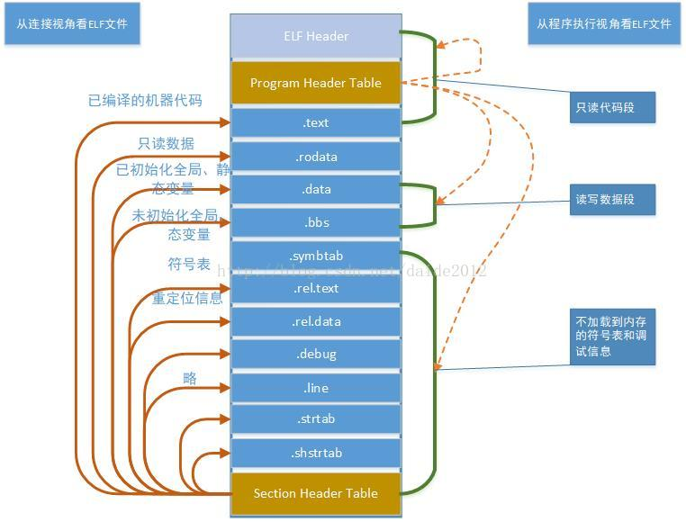

# ELF 文件详解

文档参考：https://blog.csdn.net/daide2012/article/details/73065204

https://www.cnblogs.com/gatsby123/p/9750187.html

### 1. c语言编写到打包，编译执行的过程


**先预处理阶段**，主要是文本替换，宏展开，删除注释等工作：`gcc -E hello.c hello.i `

**编译阶段**：`gcc -S hello.c hello.s`

**汇编阶段**将.s文件翻译成机器语言指令，把这些指令打包成一种叫做**可重定位目标程序**的格式：

这个阶段主要是进行**词法分析**和**语法分析**，分析错误的语法，并给出信息。:` gcc -c hello.c hello.o`

 **链接阶段**：这是将一些系统调用的函数或者其他的可执行文件链接。gcc在编译时默认使用动态库。

### 2. ELF 文件

ELF文件（Executable Linkable Format）是一种文件存储格式。Linux下的目标文件和可执行文件都按照该格式进行存。



结构：`.text`是一个`Section`, 内存中有4K对齐或者其他的对齐，为了节约内存，链接器会尽可能把相同权限属性的段（Section）分配到同一Segment， 而Section Header Table 就是相关Section的描述。

### 3. 一个C语言的项目的具体了解

一个简单的hello.c 文件

```c
#include<stdio.h>
void main(){
    printf("hello world");
}
```

使用命令 `gcc -c hello.c` =》 生成hello.o 文件

```shell
root@DESKTOP-Q6IIDQB:~/CHOME# readelf -h hello.o
ELF Header:
  Magic:   7f 45 4c 46 02 01 01 00 00 00 00 00 00 00 00 00 
  Class:                             ELF64
  Data:                              2's complement, little endian
  Version:                           1 (current)
  OS/ABI:                            UNIX - System V
  ABI Version:                       0
  Type:                              REL (Relocatable file)
  Machine:                           Advanced Micro Devices X86-64
  Version:                           0x1
  Entry point address:               0x0
  Start of program headers:          0 (bytes into file)
  Start of section headers:          712 (bytes into file)
  Flags:                             0x0
  Size of this header:               64 (bytes)
  Size of program headers:           0 (bytes)
  Number of program headers:         0
  Size of section headers:           64 (bytes)
  Number of section headers:         13
  Section header string table index: 12
```

使用 readelf查看文件ELF Header的信息，上面就是ELF Header 的信息，每一个字段的含义可以参考

[ELF结构文档](https://pdos.csail.mit.edu/6.828/2018/readings/elf.pdf)。主要是以下的内容：

1. Entry point address：程序的入口地址，这是没有链接的目标文件所以值是0x00
2. Start of section headers：段表开始位置的首字节
3. Size of section headers：段表的长度（字节为单位）
4. Number of section headers：段表中项数，也就是有多少段
5. Start of program headers：程序头的其实位置（对于可执行文件重要，现在为0）
6. Size of program headers：程序头大小（对于可执行文件重要，现在为0）
7. Number of program headers：程序头中的项数，也就是多少Segment（和Section有区别，后面介绍）
8. Size of this header：当前ELF文件头的大小，这里是64字节

**段表和段**

```
root@DESKTOP-Q6IIDQB:~/CHOME# readelf -SW hello.o
There are 13 section headers, starting at offset 0x2c8:

Section Headers:
  [Nr] Name              Type            Address          Off    Size   ES Flg Lk Inf Al
  [ 0]                   NULL            0000000000000000 000000 000000 00      0   0  0
  [ 1] .text             PROGBITS        0000000000000000 000040 000018 00  AX  0   0  1
  [ 2] .rela.text        RELA            0000000000000000 000218 000030 18   I 10   1  8
  [ 3] .data             PROGBITS        0000000000000000 000058 000000 00  WA  0   0  1
  [ 4] .bss              NOBITS          0000000000000000 000058 000000 00  WA  0   0  1
  [ 5] .rodata           PROGBITS        0000000000000000 000058 00000c 00   A  0   0  1
  [ 6] .comment          PROGBITS        0000000000000000 000064 00002a 01  MS  0   0  1
  [ 7] .note.GNU-stack   PROGBITS        0000000000000000 00008e 000000 00      0   0  1
  [ 8] .eh_frame         PROGBITS        0000000000000000 000090 000038 00   A  0   0  8
  [ 9] .rela.eh_frame    RELA            0000000000000000 000248 000018 18   I 10   8  8
  [10] .symtab           SYMTAB          0000000000000000 0000c8 000120 18     11   9  8
  [11] .strtab           STRTAB          0000000000000000 0001e8 00002b 00      0   0  1
  [12] .shstrtab         STRTAB          0000000000000000 000260 000061 00      0   0  1
Key to Flags:
  W (write), A (alloc), X (execute), M (merge), S (strings), I (info),
  L (link order), O (extra OS processing required), G (group), T (TLS),
  C (compressed), x (unknown), o (OS specific), E (exclude),
  l (large), p (processor specific)
```

这是相应每个端的数据类型和相关的详情数据。

相关的代码段的数据, 这个是和上面的Section Headers 一一对应的数据，`.text`是运行的代码。 

```
root@DESKTOP-Q6IIDQB:~/CHOME# objdump -s hello.o 

hello.o:     file format elf64-x86-64

Contents of section .text:
 0000 554889e5 488d3d00 000000b8 00000000  UH..H.=.........
 0010 e8000000 00905dc3                    ......].        
Contents of section .rodata:
 0000 68656c6c 6f20776f 726c6400           hello world.    
Contents of section .comment:
 0000 00474343 3a202855 62756e74 7520372e  .GCC: (Ubuntu 7.
 0010 352e302d 33756275 6e747531 7e31382e  5.0-3ubuntu1~18.
 0020 30342920 372e352e 3000               04) 7.5.0.      
Contents of section .eh_frame:
 0000 14000000 00000000 017a5200 01781001  .........zR..x..
 0010 1b0c0708 90010000 1c000000 1c000000  ................
 0020 00000000 18000000 00410e10 8602430d  .........A....C.
 0030 06530c07 08000000                    .S......   
```

可以根据 上面的图片结合这些看出，代码的含义，这些代码还是可以进一步的解析。

变量的相关位置也是可以从第一张图进行了解的。

