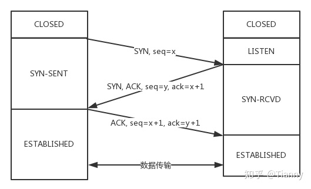

### 浏览器输入一个url 中间经历的过程

DNS查询（是否有缓存）-》TCP握手》http 请求》反向nginx》uwsgi/gunicorn》 web app响应》TCP挥手

1. 浏览器地址栏输入url
2. 浏览器先查看DNS缓存，如果有跳过第三步
3. DNS 域名解析，解析相应的IP地址
4. 浏览器向服务器发起tcp链接，与服务器创建tcp三次握手。
5. 握手成功后，浏览器向服务器发送http请求，请求数据包
6. 服务器处理收到的请求，将数据返回至浏览器
7. 浏览器根据相应返回数据渲染页面

### TCP 三次握手

http://www.52im.net/thread-258-1-1.html

重点：**状态转化**  发送的内容

`过程描述` 1

- 假定主机 A 运行的是 TCP 客户程序，而 B 运行 TCP 服务器程序。
- 最初两端的 TCP 进程都处于 CLOSED（关闭）状态。
- A 向 B 发出连接请求报文段，这时报文段首部中的同步位 SYN = 1，同时选择一个初始序号 seq = x。这时，A 进入 SYN-SENT（同步已发送）状态。
- B 收到连接请求报文段后，则向 A 发送确认。在确认报文段中应把 SYN 位和 ACK 位都置1，确认号是 ack = x + 1，同时也为自己选择一个初始序号 seq = y。
- A 收到 B 的确认后，还要向 B 给出确认。确认报文段的 ACK 置 1，确认号 ack = y + 1，而自己的序号 seq = x + 1。
- TCP 连接已经建立，A 进入 ESTABLISHED（已建立连接）状态。
- 当 B 收到 A 的确认后，也进入 ESTABLISHED 状态

`过程描述`2

- ①首先 Client 端向Server端发送连接请求报文，这时，Client 进入SYN-SENT（同步已发送）状态。
- ②Server 段接受连接后回复 ACK 报文，并为这次连接分配资源。
- ③Client 端接收到 ACK 报文后也向 Server 段发生 ACK 报文，并分配资源，这样 TCP 连接就建立了。

SYN 攻击：  客户端没有进行第三次握手，导致服务资源的浪费

### TCP 四次挥手

http://www.52im.net/thread-258-1-1.html

 【TODO】

### TCP和UDP 的区别

TCP面向链接、可靠的、基于字节流，TCP有超时重传，错误重传，有序的

UDP 是无连接、不可靠、面向报文的， 无序不可靠的协议

### HTTP 协议

**请求**

- 状态行     [GET|POST]    [URL]   [HTTP/1.1]
- 请求头   Host User-Agent 等
- 消息主体

**返回**

- 状态行    HTTP/1.1 200 OK
- 响应头  
- 响应正文

**常见状态码**

| 1**  | 信息，服务器收到请求，需要请求者继续执行操作   |
| ---- | ---------------------------------------------- |
| 2**  | 成功，操作被成功接收并处理                     |
| 3**  | 重定向，需要进一步的操作以完成请求             |
| 4**  | 客户端错误，请求包含语法错误或无法完成请求     |
| 5**  | 服务器错误，服务器在处理请求的过程中发生了错误 |

**GET VS POST**

restful 语义上GET是获取，POST 是创建

GET 是**幂等**的，POST非幂等

GET将参数放到url明文中，长度限制；POST放在请求体，更安全

#### HTTP 长链接

请求头 Connection:keep-alive

如何区分不同的HTTP请求？Content-Length | Transfer-Encoding:chunked

#### cookie 和session区别

 【TODO】

### IO复用

五种网络模型

- 阻塞I/O模型
- 非阻塞I/O模型
- I/O复用模型    select  poll epoll  时间复杂度不同On On O1  连接过多使用epoll
- 信号驱动I/O模型  （不常用）
- 异步IO模型 （不常用）

### 如何提升并发能力

1.多线程或者多进程， 线程/进程创建开销大，使用线程池解决
